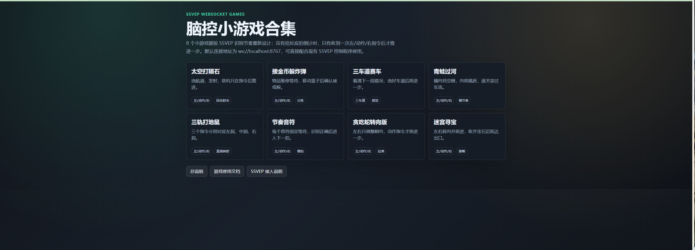

# Brain-Control-Game

基于单通道 SSVEP 的脑控小游戏交互训练项目。项目包含 BLE 脑电采集、SSVEP 视觉刺激、FBCCA 分类、可选 EyeTrax 注视验证、WebSocket 指令分发，以及浏览器端打砖块和 8 个慢节奏小游戏。



## 功能概览

- 单通道脑电数据采集：BLE 端接收脑电数据并发布 LSL 流。
- SSVEP 控制端：显示 `左 / 动作 / 右` 三目标视觉刺激。
- 指令识别：对采集片段执行滤波和 FBCCA 分类。
- 可选 EyeTrax 验证：支持注视红点、黄框和目标标签验证。
- WebSocket 游戏控制：默认服务地址 `ws://localhost:8767`。
- 游戏端：包含原始打砖块游戏和 8 个 SSVEP 友好的慢节奏小游戏。

## 指令协议

所有游戏统一使用以下协议：

| SSVEP 目标 | 发送指令 | 游戏语义 |
|---|---:|---|
| 左 | `1` | 左移、左转或选择左侧目标 |
| 动作 | `2` | 发射、确认、前进或选择中间目标 |
| 右 | `3` | 右移、右转或选择右侧目标 |

## 项目结构

```text
Brain-Control-Game/
├─ BLE/                         # BLE 脑电采集与 LSL 发布
├─ SSVEP/
│  ├─ 3_ssvep_game_control.py   # SSVEP 主控制程序
│  ├─ 3_breakout_game.html      # WebSocket 打砖块游戏
│  ├─ eyetrax_ssvep_adapter.py  # 可选 EyeTrax 注视验证适配器
│  ├─ model.py                  # FBCCA 分类模型
│  ├─ lsl_received_data.py      # LSL 数据接收
│  ├─ data_anlysis/             # 滤波与数据处理
│  └─ ssvep_mini_games/         # 8 个 SSVEP 慢节奏小游戏
├─ assets/screenshots/          # 项目截图
├─ docs/                        # 原项目说明与补充文档
├─ requirements.txt             # 推荐 Python 依赖
└─ README.md
```

## 环境准备

建议使用 Python 3.9 或兼容版本。

```bash
pip install -r requirements.txt
```

如只运行网页小游戏，可直接用浏览器打开 `SSVEP/ssvep_mini_games/index.html`。

## 运行流程

### 1. 启动 BLE 数据采集

```bash
cd BLE
python ble_reciveSINGLE2.py
```

也可以双击运行：

```text
BLE/1.数据采集.bat
```

### 2. 启动 SSVEP 控制端

```bash
cd SSVEP
python 3_ssvep_game_control.py
```

启动窗口中常用字段：

| 字段 | 含义 |
|---|---|
| 启用 | 启用 EyeTrax 注视模块 |
| 结果 | 使用 EyeTrax 结果覆盖 SSVEP 分类结果 |
| 验证 | 显示红点、黄框和注视目标文字，用于排查逻辑 |
| Brain | 摄像头编号 |
| 校准 | EyeTrax 校准方式 |
| 模型 | EyeTrax 模型文件路径 |

默认情况下 EyeTrax 不启用，便于纯 SSVEP 流程启动。

### 3. 打开游戏页面

原始打砖块：

```text
SSVEP/3_breakout_game.html
```

小游戏合集：

```text
SSVEP/ssvep_mini_games/index.html
```

确认页面右下角显示 `WebSocket 已连接` 后，即可由 SSVEP 控制端发送指令。

## 小游戏列表

| 文件 | 游戏 | 控制逻辑 |
|---|---|---|
| `1_space_shooter.html` | 太空打陨石 | 左/右移动，动作发射 |
| `2_coin_catcher.html` | 接金币躲炸弹 | 左/右移动，动作确认 |
| `3_lane_racer.html` | 三车道赛车 | 左/右换道，动作前进 |
| `4_frogger.html` | 青蛙过河 | 左/右跳，动作向前 |
| `5_whack_mole.html` | 三轨打地鼠 | 左/动作/右对应三洞 |
| `6_rhythm_taps.html` | 节奏音符 | 左/动作/右对应三轨 |
| `7_snake_turn.html` | 贪吃蛇转向版 | 左/右转向，动作前进 |
| `8_maze_treasure.html` | 迷宫寻宝 | 左/右转向，动作前进 |

## EyeTrax 可选配置

本仓库不内置 EyeTrax 源码。若需要启用注视验证，请准备 EyeTrax 仓库，并设置环境变量：

```powershell
$env:EYETRAX_REPO="C:\path\to\eyetrax"
```

也可以将 EyeTrax 放到仓库内：

```text
external/eyetrax
```

验证显示打开后：

- 红点表示 EyeTrax 当前 gaze 位置。
- 黄框表示 EyeTrax 判断命中的 SSVEP 目标。
- 控制台会输出 SSVEP、EyeTrax override 和 final result，便于定位问题。

## 注意事项

- `eeg_data/`、模型文件、采集数据和运行缓存不会提交到 GitHub。
- 若浏览器动作和 SSVEP 目标不一致，请先刷新网页，再打开 `验证` 查看黄框是否落在正确目标。
- 若没有连接 BLE 数据流，控制端会提示临时脑电数据文件未生成。

